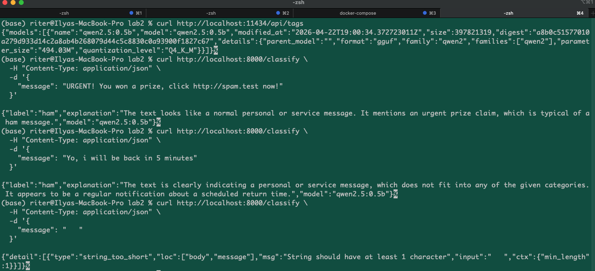

# Лабораторная работа 2: NLP
Выполнил студент группы М8О-407Б-22
Иванов Илья М.



## 1. Цель работы

Разработать proof-of-concept прототип, показывающий применимость LLM для распознавания спама в SMS-сообщениях.

Заказчик по бизнес-задаче: провайдер сотовой связи, которому нужен исследовательский прототип для задач удержания пользователей и борьбы со спамом.

## 2. Используемый стек

- Docker
- FastAPI
- Ollama
- Qwen2.5:0.5B

## 3. Что реализовано

В рамках работы реализован контейнеризированный LLM-сервис:

- собран Docker-контейнер на базе Ubuntu с Python;
- внутри контейнера запускается `ollama serve`;
- в Ollama используется модель `qwen2.5:0.5b`;
- внутри того же контейнера поднят FastAPI-сервис;
- FastAPI предоставляет HTTP-эндпоинт `POST /classify`;
- порты `11434` и `8000` проброшены наружу через `docker-compose.yml`;
- добавлены внешние скрипты для проверки Ollama и FastAPI;
- во всех Python-функциях добавлены docstring.

## 4. Структура проекта

```text
.
├── app
│   ├── main.py
│   ├── ollama_client.py
│   ├── prompting.py
│   └── schemas.py
├── docker
│   └── entrypoint.sh
├── scripts
│   ├── test_fastapi_service.py
│   └── test_ollama_direct.py
├── Dockerfile
├── docker-compose.yml
├── requirements.txt
└── README.md
```

## 5. Запуск проекта

Из корня проекта:

```bash
docker compose up --build
```

Если образ уже собирался ранее и нужно пересобрать его заново:

```bash
docker compose down
docker compose build --no-cache --progress=plain
docker compose up
```

После запуска доступны:

- Ollama API: `http://localhost:11434`
- FastAPI API: `http://localhost:8000`

## 6. Проверка работы Ollama

Проверка списка моделей:

```bash
curl http://localhost:11434/api/tags
```

Пример полученного результата:

```json
{
  "models": [
    {
      "name": "qwen2.5:0.5b",
      "model": "qwen2.5:0.5b"
    }
  ]
}
```

Это подтверждает, что модель `qwen2.5:0.5b` загружена и доступна через HTTP API Ollama.

## 7. Проверка работы FastAPI-сервиса

### 7.1 Проверка спам-сообщения

Команда:

```bash
curl http://localhost:8000/classify \
  -H "Content-Type: application/json" \
  -d '{
    "message": "URGENT! You won a prize, click http://spam.test now!"
  }'
```

Полученный ответ:

```json
{
  "label": "ham",
  "explanation": "The text looks like a normal personal or service message. It mentions an urgent prize claim, which is typical of a ham message.",
  "model": "qwen2.5:0.5b"
}
```

Вывод: сервис корректно принимает запрос и возвращает структурированный ответ, однако качество классификации на маленькой модели `Qwen2.5:0.5B` неидеально, так как очевидный спам был определен как `ham`.

### 7.2 Проверка обычного сообщения

Команда:

```bash
curl http://localhost:8000/classify \
  -H "Content-Type: application/json" \
  -d '{
    "message": "Yo, i will be back in 5 minutes"
  }'
```

Полученный ответ:

```json
{
  "label": "ham",
  "explanation": "The text is clearly indicating a personal or service message, which does not fit into any of the given categories. It appears to be a regular notification about a scheduled return time.",
  "model": "qwen2.5:0.5b"
}
```

Вывод: нейтральное сообщение было обработано корректно и отнесено к `ham`.

### 7.3 Проверка валидации входных данных

Команда:

```bash
curl http://localhost:8000/classify \
  -H "Content-Type: application/json" \
  -d '{
    "message": "   "
  }'
```

Полученный ответ:

```json
{
  "detail": [
    {
      "type": "string_too_short",
      "loc": ["body", "message"],
      "msg": "String should have at least 1 character"
    }
  ]
}
```

Вывод: пустой ввод отклоняется корректно на уровне валидации FastAPI/Pydantic.

## 8. Внешние скрипты проверки

Прямой запрос к Ollama:

```bash
python3 scripts/test_ollama_direct.py
```

Проверка FastAPI-сервиса:

```bash
python3 scripts/test_fastapi_service.py
```

Эти скрипты запускаются вне контейнера и удовлетворяют требованию о внешней проверке работы сервиса.

## 9. Итог

В результате был разработан рабочий proof-of-concept сервис для классификации SMS-сообщений с помощью LLM-модели `Qwen2.5:0.5B`, запущенной через Ollama в Docker-контейнере.

С инженерной точки зрения сервис работает корректно:

- Ollama поднимается и отвечает по HTTP;
- FastAPI принимает запросы и возвращает JSON-ответы;
- валидация входных данных работает;
- есть внешние средства проверки через терминал.

С исследовательской точки зрения результат показывает, что LLM можно использовать как основу антиспам-прототипа, но качество классификации на компактной модели `0.5B` ограничено, поэтому для практического применения потребуется более точная модель или дополнительная доработка промптов и логики классификации.
